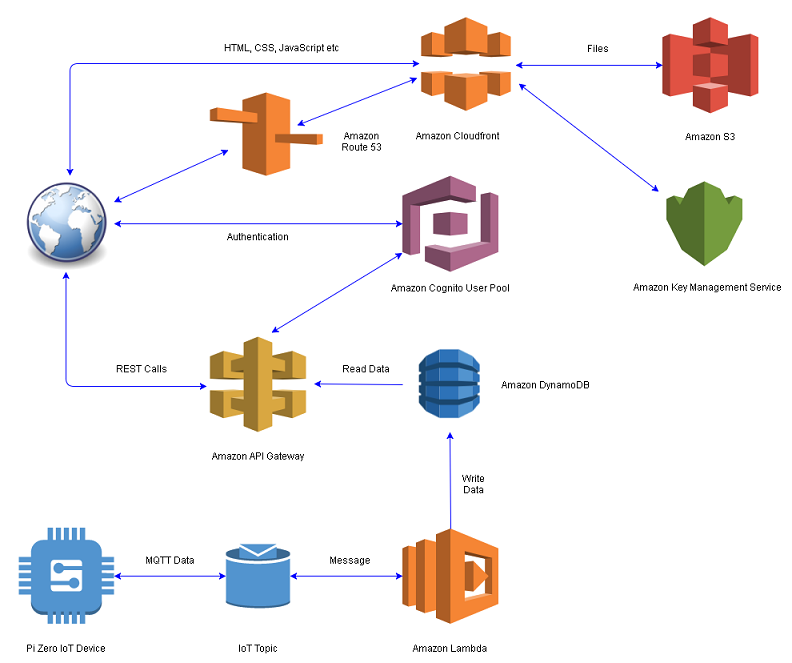

# Raspberry Pi Meets Iot Meets AWS

An IoT system using a Raspberry Pi Zero as an IoT device and AWS to host storage and web presence

     

## Logical Architecure

How the parts relate to each other

  

## IoT Device 

Electronics Package and Supporting Software [Here](rpi/README.md)

## S3

Web site file storage and domain publishing [Here](s3/README.md)

## Cognito

User Sign-Up, Sign-In, and Access Control [Here](cognito/README.md)

## API Gateway

Create and publish a REST API [Here](gateway/README.md)

## DynamoDB

JSON data storage for IoT data [Here](dynamodb/README.md)

## Lambda

Processing of incoming data from IoT device(s) [Here](lambda/README.md)

## IoT Core

MQTT based interface for handling IoT devices [Here](iot/README.md)

# Example Data Output

