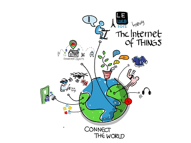
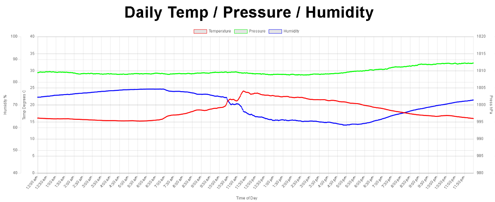

# Front End Software - Static Web Site



## General Description

The web site is used to demonstrate a number of areas of functionality.

* Content for S3 hosting
* Account management via Cognito - Login / Account Verification / Account Creation
* API access via Gateway
* Data Display

*Note:* The AWS interface code was based on the code presented below:

### Wild Rydes 

The [Wild Rydes](http://wildrydes.com) site. Example [deployment](https://medium.com/employbl/tutorial-for-building-a-web-application-with-amazon-s3-lambda-dynamodb-and-api-gateway-6d3ddf77f15a)

### aws-serverless-workshops

Code and walkthrough labs to set up serverless applications for Wild Rydes workshops. On [GitHub](https://github.com/aws-samples/aws-serverless-workshops)

## Configuration

Basic AWS configuration information is held in [config.js](../website/js/config.js).  This tells the application what its needs to:

* Have a conversation with Cognito
* Where the API endpoint is located

```javascript
    cognito: {
        userPoolId: '<pool id>>', // e.g. us-east-2_uXboG5pAb - Cognito -> User Pools
        userPoolClientId: '<client id>', // e.g. 25ddkmj4v6hfsfvruhpfi7n4hv - Cognito -> User Pools -> App clients
        region: '<your region>' // e.g. us-east-2 - your hosting region
    },
    api: {
        // e.g https://{restapi_id}.execute-api.{region}.amazonaws.com/{stage_name}/
        // From: API Gateway -> APIs -> Stages
        invokeUrl: '<Your invoke URL>',
        ...
    }
```

JavaScript Cognito libraries are held [here](https://github.com/amazon-archives/amazon-cognito-identity-js) in GitHub.

*Note:* This library has now been deprecated and continued development is as part of the [AWS Amplify](https://github.com/aws-amplify/amplify-js/tree/master/packages/amazon-cognito-identity-js) GitHub repository.

Core Cognito functionality is obtained by importing the following library:

[aws-cognito-sdk.min.js](https://github.com/amazon-archives/amazon-cognito-identity-js/tree/master/dist)

Functionality to allow user sign-up and sign-in is obtained by importing the following library:

[amazon-cognito-identity.min.js](https://github.com/amazon-archives/amazon-cognito-identity-js/tree/master/dist)

A full set of examples of the JavaScript SDK can be found [here](https://docs.aws.amazon.com/cognito/latest/developerguide/using-amazon-cognito-user-identity-pools-javascript-examples.html)


## Account Creation

To create an accoount, a user needs (in this example) to supply an email address (used as the user name) and a password.  A call is then made to AWS
to start the sign-up process.  Various options are available within Cognito to define what actions are needed.  These options include:

* Password requirements
* Self sign up / admin sign up
* Account expiry 
* Manual accoount creation
* MFA
* Verification SMS / email messages

See `Cognito -> User Pools > <my pool> -> Policies` for further details.

Sample code.

```javascript
    function register(email, password, onSuccess, onFailure) {
        let dataEmail = {
            Name: 'email',
            Value: email
        };
        let attributeEmail = new AmazonCognitoIdentity.CognitoUserAttribute(dataEmail);

        userPool.signUp(toUsername(email), password, [attributeEmail], null,
            function signUpCallback(err, result) {
                if (!err) {
                    onSuccess(result);
                } else {
                    onFailure(err);
                }
            }
        );
    }
```

## Verification

If verification (SMS/email) is used, the user will need to return a verification code to activate the account.

Sample code.

```javascript
    function verify(email, code, onSuccess, onFailure) {
        createCognitoUser(email).confirmRegistration(code, true, function confirmCallback(err, result) {
            if (!err) {
                onSuccess(result);
            } else {
                onFailure(err);
            }
        });
    }
```

## Login 

Once a user has an activated account, to use AWS functionality, they must login.  This process returns an Access Token (JWT)

Sample code.

```javascript
function signin(email, password, onSuccess, onFailure) {
    let authenticationDetails = new AmazonCognitoIdentity.AuthenticationDetails({
        Username: toUsername(email),
        Password: password
    });

    let cognitoUser = createCognitoUser(email);
    cognitoUser.authenticateUser(authenticationDetails, {
        onSuccess: onSuccess,
        onFailure: onFailure
    });
}
```
The JWT can then be recovered by accessing the user session
```javascript
let cognitoUser = userPool.getCurrentUser();
cognitoUser.getSession(function sessionCallback(err, session) {
    if (err) {
        reject(err);
    } else if (!session.isValid()) {
        resolve(null);
    } else {
        resolve(session.getIdToken().getJwtToken());
    }
});
```

If required, the JWT can also be be recovered immediately from the `authenticateUser` method.

```javascript
cognitoUser.authenticateUser(authenticationDetails, {
    onSuccess: function (result) {
        var accessToken = result.getAccessToken().getJwtToken();
        }
```

The obtained JWT can be then used to identify the user to other AWS services, such as the API Gateway.

## API Access

Access to the API Gateway is performed via a simple AJAX call (In this instance, handled by jquery).  

Sample code (Call to http:<endpoint>/all/dd-mm-yyyy).
```javascript
    function getAllData(date) {
        $.ajax({
            method: 'GET',
            url: _config.api.invokeUrl + '/all/' + date,
            headers: {
                Authorization: authToken
            },
            contentType: 'application/json',
            success: drawGraph,
            error: function ajaxError(jqXHR, textStatus, errorThrown) {
                console.error('Error requesting AWS data: ', textStatus, ', Details: ', errorThrown);
                console.error('Response: ', jqXHR.responseText);
                alert('An error occured when requesting AWS data:\n' + jqXHR.responseText);
            }
        });
    }
```
The `authtoken` is the JWT derived from the login process. For this to work, the User Pool defined in Cognito must be made know to the API endpoint the Gateway.
 
API Gateway -> APIs -> `your api` -> Authorizers 

On successful completion, a call is made to `drawGraph`, which is responsible for handling the returned JSON data.  

## Data Display

The display of the graph data is handled by the [Chart.js](https://www.chartjs.org/) library. 

The result:


