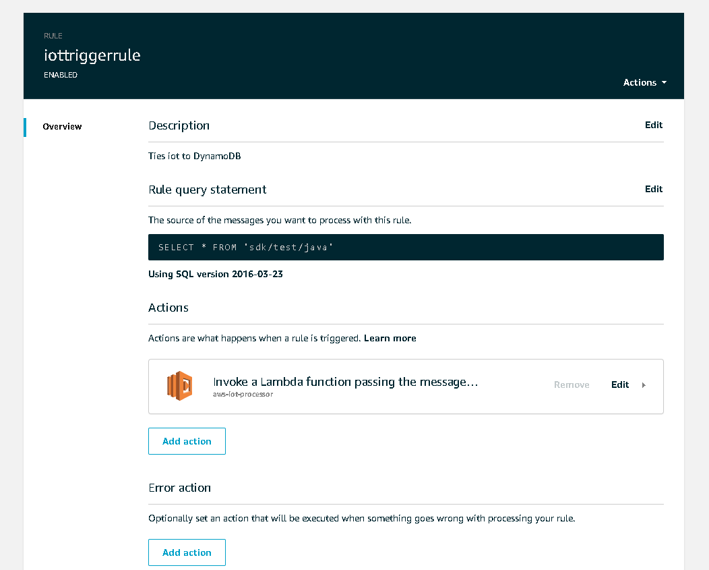

# Amazon IoT Core 

[Official Documentation](https://aws.amazon.com/documentation/iot/)

## Add A Device

To add a device (In this case a Raspberry Pi), follow the *Connect to AWS IoT* wizrd, selecting the *Configuring a device* path.

## Add A Rule

Once a device has been integrated into IoT Core, you need a method to process incoming messages.  To do this, define a rule and enable it.

For this project, the rule needs to copy all incoming data from the MQTT queue to the Lambda used to process it. This is achieved by adding 

### ... a message source

`SELECT * FROM 'sdk/test/java'`

### ...and a message action

`Invoke a Lambda function passing the message data`

### Config Screen

