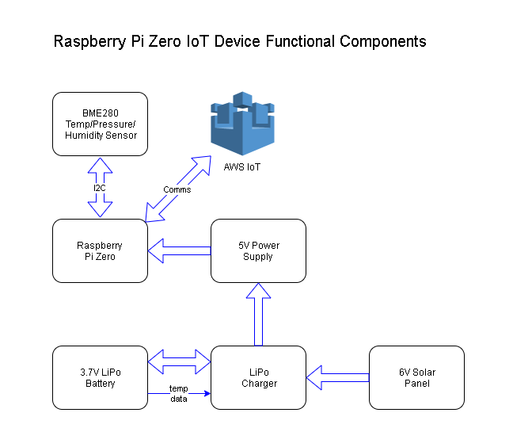

# Raspberry Pi Zero as an IoT Device 

## Raspberry Pi Zero

A Raspberry Pi Zero was chosen as the compute element of the project as it had a number of desirable features:

* Low cost
* Low power consumption (Essential in a solar powered project)
* Excellent software support
* Wide range of sensors available
* Small physical size 
* Built-in WiFi

[Full details here](computer.md)

## Sensor Package

The sensor package chosen was the BME280 from [Bosch](https://www.bosch-sensortec.com/bst/products/all_products/bme280). 
This device is capable of supplying accurate temperature, pressure and humidity data over the I2C bus. The device is very low cost and is
readily available from various sources, including eBay.

[Full details here](sensor.md)

## Power Supply

The aim of the power supply is to generate a stable 5V supply with sufficient power to enable operation of the Raspberry Pi. Power is derived from
either a solar panel or a LiPo battery when sunlight is not available. The chosen system comprises the following off the shelf components from 
[Adafruit](https://www.adafruit.com/)

* 6V solar panel - must be sufficient to generate power during winter
* LiPo charge controller - able to switch between solar and battery sources. Excess solar used to recharge the battery
* DC / DC converter with 5V output
* LiPo battery

[Full details here](power.md)

## Software

The software was required to perform three operations

* Read sensor data
* Send data to AWS when WiFi is available
* Store data for later transmission when WiFi is not available

[Full details here](software.md)

