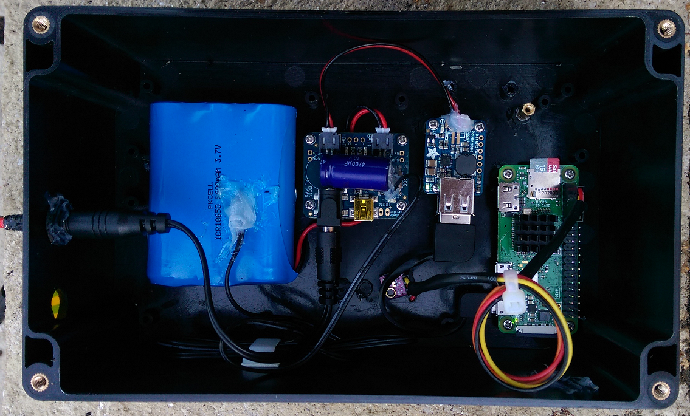

# Raspberry Pi Zero as an IoT Device 


## Raspberry Pi Zero

A Raspberry Pi Zero was chosen as the compute element of the project as it had a number of desirable features:

* Low cost
* Low power consumption (Essential in a solar powered project)
* Excellent software support
* Wide range of sensors available
* Small physical size 
* Built-in WiFi

The model chosen was the Raspberry Pi Zero W (No soldered header, WiFi onboard). Only the required pins for the I2C interface and the onbaord reset where added.

As a precaution, a copper heatsink was also added to the processor.  While unlikely to overheat, the environmental temperature may get high due to possible solar heating effects.

## Security

...or how not to get owned by a the script kiddies 

A run down of how to secure an RPi device can be found here. [Documentation](https://www.raspberrypi.org/documentation/configuration/security.md)

In summary:
- [ ] Update the software
- [ ] Use SSH
- [ ] Create a new user and delete the pi user 
- [ ] Install and configure a firewall

### UFW Firewalll Rule

A simple rule to limit ssh connections from one network area.

```sudo ufw limit from 192.168.0.0/24 to any port 22 proto tcp```

## Sensor Package

The sensor package chosen was the BME280 from [Bosch](https://www.bosch-sensortec.com/bst/products/all_products/bme280). 
This device is capable of supplying accurate temperature, pressure and humidity data over the I2C bus. The device is very low cost and is
readily available from various sources, including eBay.  The only difference I have found with various implementations is the I2C bus address. This 
can be easily found by use of the `sudo i2cdetect -y 1` which should give a display such as:

```
     0  1  2  3  4  5  6  7  8  9  a  b  c  d  e  f
00:          -- -- -- -- -- -- -- -- -- -- -- -- -- 
10: -- -- -- -- -- -- -- -- -- -- -- -- -- -- -- -- 
20: -- -- -- -- -- -- -- -- -- -- -- -- -- -- -- -- 
30: -- -- -- -- -- -- -- -- -- -- -- -- -- -- -- -- 
40: -- -- -- -- -- -- -- -- -- -- -- -- -- -- -- -- 
50: -- -- -- -- -- -- -- -- -- -- -- -- -- -- -- -- 
60: -- -- -- -- -- -- -- -- -- -- -- -- -- -- -- -- 
70: -- -- -- -- -- -- 76 --  
```

Note: If the command is not present, install using `sudo apt-get install i2c-tools`

The required connections for the sensor module to I2C are:

| Module PCB | Usage | GPIO Header |
|:-----|:-----|:-----|
|VCC | 3.3V | P1-01 |
|GND | Ground | P1-06 |
|SCL | I2C SCL | P1-05 |
|SDA | I2C SDA | P1-03 |

## Power Supply and Power Management

The aim of the power supply is to generate a stable 5V supply with sufficient power to enable operation of the Raspberry Pi. Power is derived from
either a solar panel or a LiPo battery when sunlight is not available. The chosen system comprises the following off the shelf components from 
[Adafruit](https://www.adafruit.com/)

* 6V solar panel - must be sufficient to generate power during winter
* LiPo charge controller - able to switch between solar and battery sources. Excess solar used to recharge the battery
* DC / DC converter with 5V output
* LiPo battery

[Full details here](power.md)

## Software

The software was required to perform three tasks

* Read sensor data
* Send data to AWS when WiFi is available
* Store data for later transmission when WiFi is not available

[Full details here](software.md)


## Prototype Hardware




